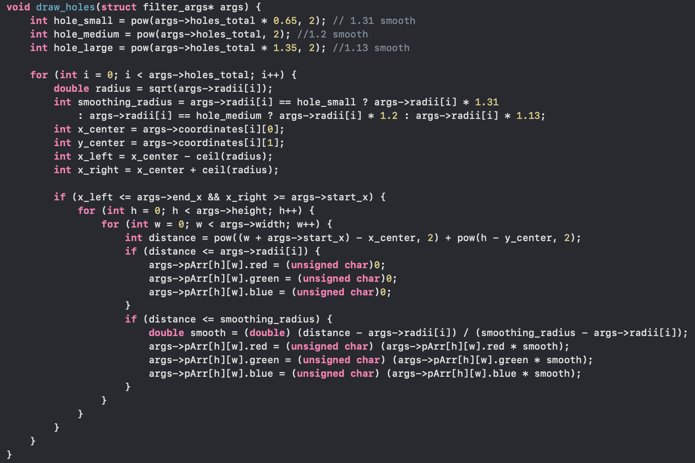

# Borys Banaszkiewicz - Parallel Image Filtering

## Overview
This project implements a multi-threaded image filtering application in C. It leverages the power of multithreading to apply various filters to images efficiently. The program can process BMP images
quickly by dividing the workload among multiple threads, making it significantly faster than single-threaded implementations.

Supported Filters:
 - grayscale
 - swiss cheese
 - blur

Before and After applying filter to an image:
 

## Algorithms used

### Box blur

### Yellow filter

### Generating holes

